<p align="center">
  
</p>

<h1 align="center">Greener Pastures - A Data Science Mod</h1>

<p align="center">
  <b>Your Cobblemon breeding operation, run like a lab.</b><br>
  Eggs as data · a real in-game console · a six-cabinet Game Corner<br><br>
  <a href="https://www.curseforge.com/minecraft/mc-mods/greener-pastures-cobblemon">CurseForge</a> ·
  Modrinth: under review ·
  <a href="https://ko-fi.com/donaldgallianoiii">Ko-fi</a> ·
  MIT licensed
</p>

---

One item - the **Notebook** - is a real web app rendered inside Minecraft (via MCEF). Link your
pastures to it and every egg becomes *data*: filtered by IVs, nature and shininess through a visual
node graph you wire yourself, banked losslessly in the **BioBank**, or rendered into **Data** - the
currency behind rented Daemon buffs, breeding augments, and 17 hidden rituals.

- **Fabric 1.21.1 · Java 21** · requires [Cobblemon](https://modrinth.com/mod/cobblemon) + Fabric API
- [MCEF](https://modrinth.com/mod/mcef) renders the console (client-only; without it you get a friendly install prompt)
- [Cobbreeding](https://modrinth.com/mod/cobbreeding) activates the breeding half (multi-pair Kernels, egg IV reads)
- 369 unit tests on MC-free cores · server-authoritative arcade · adversarially reviewed pre-release

Full feature tour: the Modrinth page, or [`docs/dev/SHOWCASE.md`](docs/dev/SHOWCASE.md).
Player-facing changelog: [`CHANGELOG.md`](CHANGELOG.md).

## Screenshots

*Wire your breeding line like a lab - filters, sinks, and live shiny odds:*

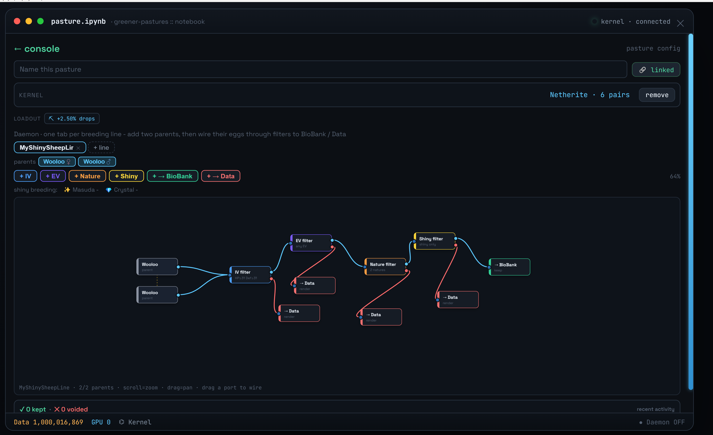

| | |
|---|---|
| 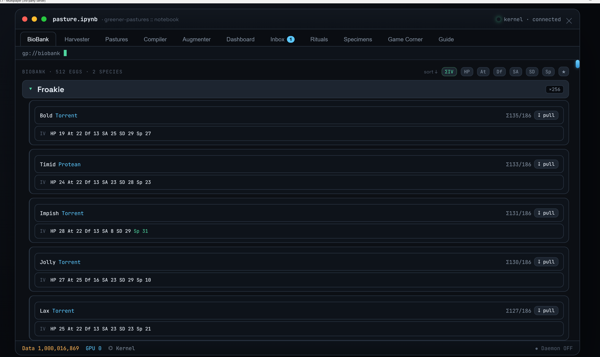 *The BioBank - eggs as data* | 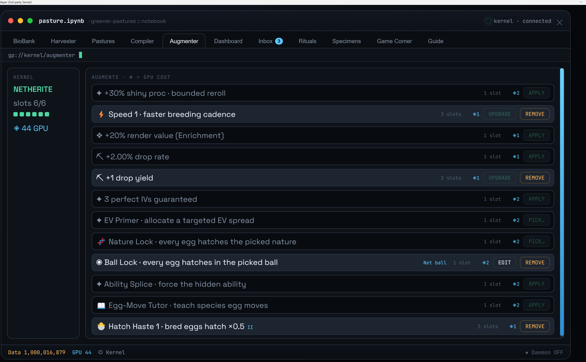 *The Augmenter - breeding meta, in the UI* |
| 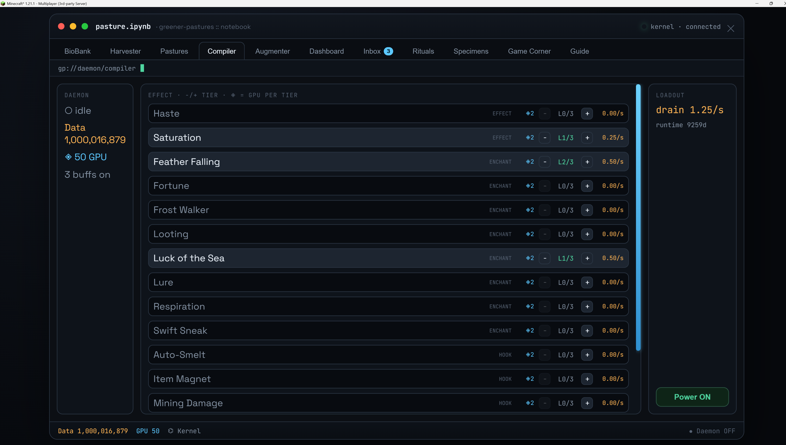 *The Daemon - buffs beyond vanilla caps* | 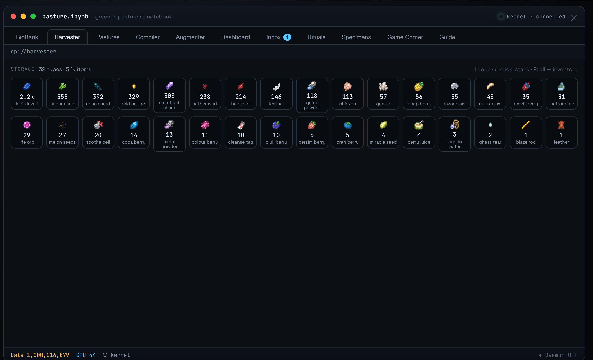 *The Harvester - your pastures, farming for you* |
| 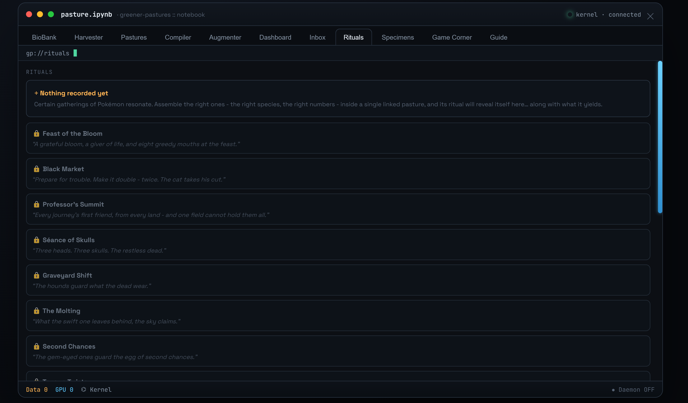 *17 hidden rituals, riddles only* | 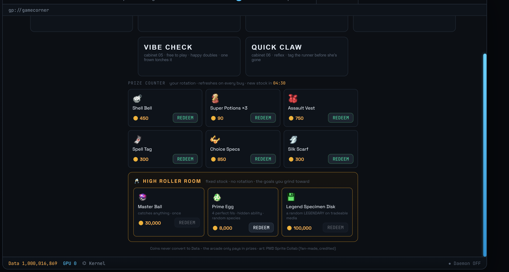 *Prize Counter + the High Roller Room* |
| 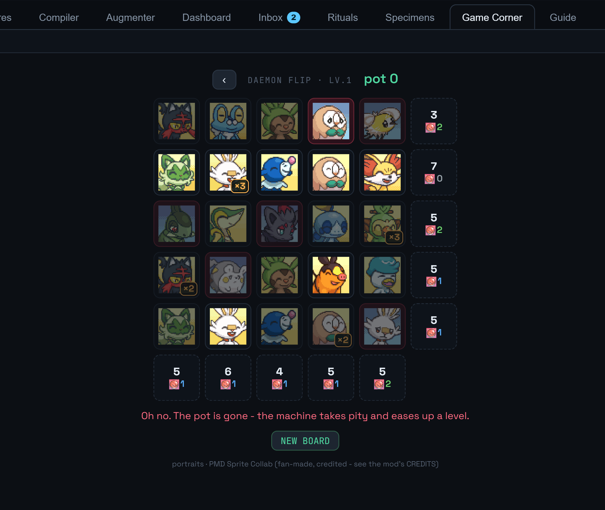 *DAEMON FLIP - deduction and heartbreak* | 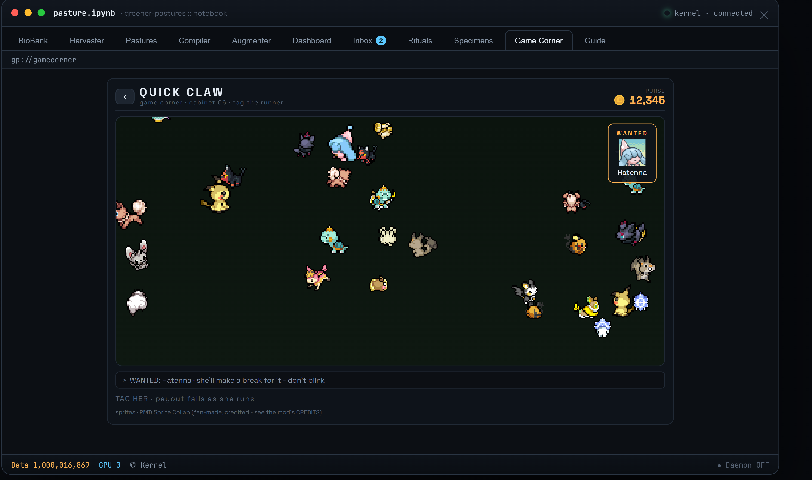 *QUICK CLAW - tag the runner* |
| 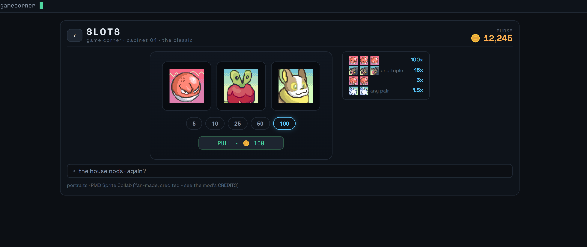 *SLOTS - honestly rigged (95%, unit-tested)* | 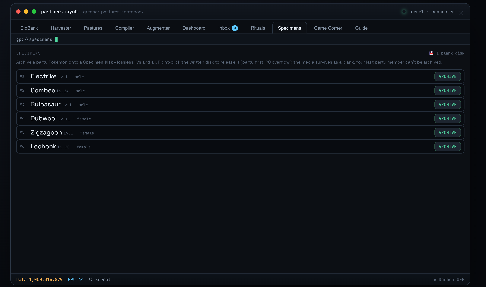 *Specimen Disks - your mons, as data* |

## Repo layout

This is a working monorepo - Greener Pastures is the headline, the rest is the workshop around it.

| Path | What it is |
|---|---|
| **`greener-pastures/`** | The mod (Fabric, Java 21) - `src/main/java/com/greenerpastures/` |
| **`greener-pastures-ui/`** | The Notebook console (React + Vite, built into the jar as one HTML file) |
| `docs/dev/` | Design specs, QA boards, and working docs - the mod's paper trail |
| `shedscope/`, `egg-oracle/`, `shiny-egg-*/`, `hydrogrid/`, `pasturekeeper/` | Sibling Cobblemon mods; several grew into Greener Pastures features |
| `pokesnack/`, `pokesnack-planner/`, `analysis/`, `data/` | The origin story: the Python snack-odds engine this repo was named after |

## Building from source

```bash
# 1) Build the console UI into the mod's resources
cd greener-pastures-ui && npm install && npm run build

# 2) Build the jar (Java 21)
cd ../greener-pastures && ./gradlew build
# -> build/libs/greenerpastures-<version>.jar

# Run the headless test suite on its own
./gradlew test
```

## Contributing / branches

`main` is the verified-release line; day-to-day work happens on `dev`. Bug reports welcome in
[Issues](https://github.com/DonaldGallianoIII/GreenerPastures/issues) - it's a beta, and fixes ship fast.

## License & credits

Code is [MIT](LICENSE). The Game Corner's portraits and walk sprites are fan-made art from the
community-run [PMD Sprite Collab](https://sprites.pmdcollab.org/) - **not** covered by the MIT
license, verified rip-free per emotion/animation, with all 45 artists credited in
[`CREDITS-PMD.md`](CREDITS-PMD.md), inside the jar, and on the in-game About card.

Built by **DonaldGalliano**.
